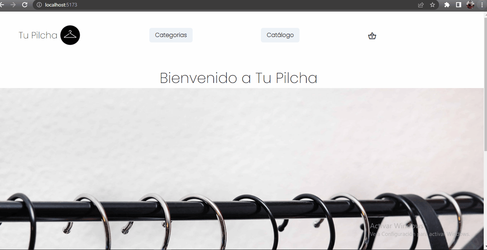

# Proyecto Ecommerce "Mi Pilcha" con React
---
**Ingrese "npm run dev" en su terminal para ejecutar este proyecto.**

_Este es un proyecto en el cual se relizara un Ecommerce estilo tienda de Ropa, la cual consta de una Bienvenida, una seccion Catalogo y una seccion Categorias. Al seleccionar Catalogo se mostrara todos los productos en su respectiva Card, al seleccionar Categorias podra filtrar los productos por 3 categorias: Hombre, Mujer e Infantil; dependiendo de la categoria seleccionada se mostrara los productos de dicha Categoria y podra ver los detalles de ese producto clikeando "Detalles". En un futuro podra seleccionar la cantidad de prendas deseadas para posteriormente realizar su compra._

|Nombre|Apellido|LikedIn|
|------|--------|-------|
|Matias|Fernandez|[Mi LinkedIn](https://www.linkedin.com/in/matias-yoel-fernandez-33840a235/)

-**Ecommerce Funcionando**

